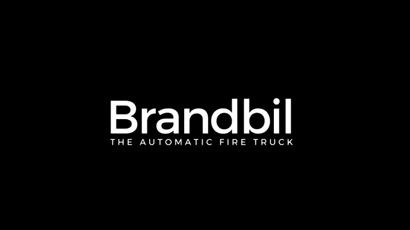
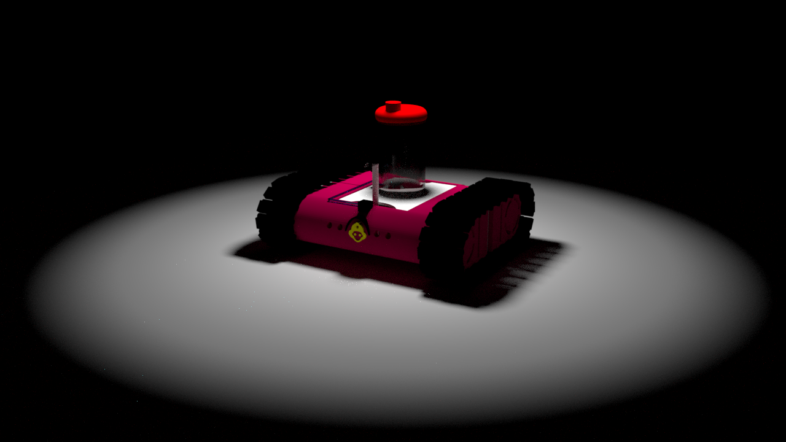

# Brandbil

In recent years, the presence of fires worldwide has been increasing. Not only were human lives taken, the economic cost behind the fires is very high. The solution? Brandil:

This is a electronic technician proyect to build a little machine that detects and prevents fires. It's just a propotype. The idea is to build something bigger. This is the picture of the prototype:

We use 16F886 PIC Microcontroller and C/Assembly programming. If you want more information, we have the technical and general spanish informs in the repository.

# Developers
<ul>
    <li>Martin Hernan Mollo</li>
    <li>Nahuel Gonzalo Liberto</li>
    <li>Lucas Ariel Saavedra</li>
</ul>